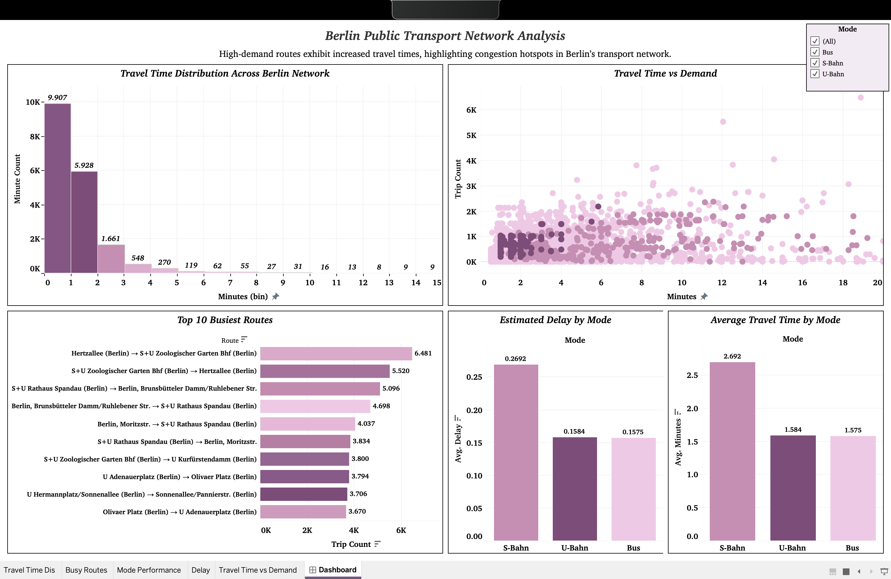
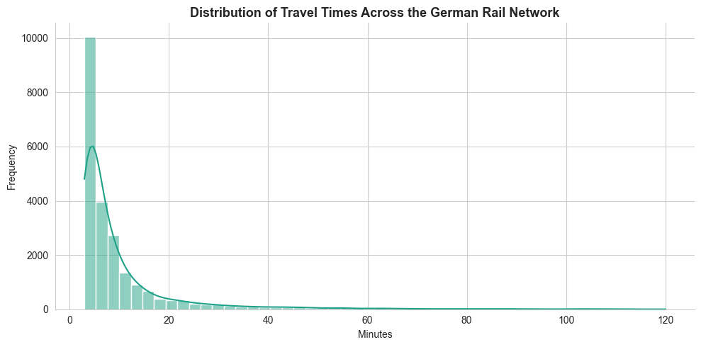
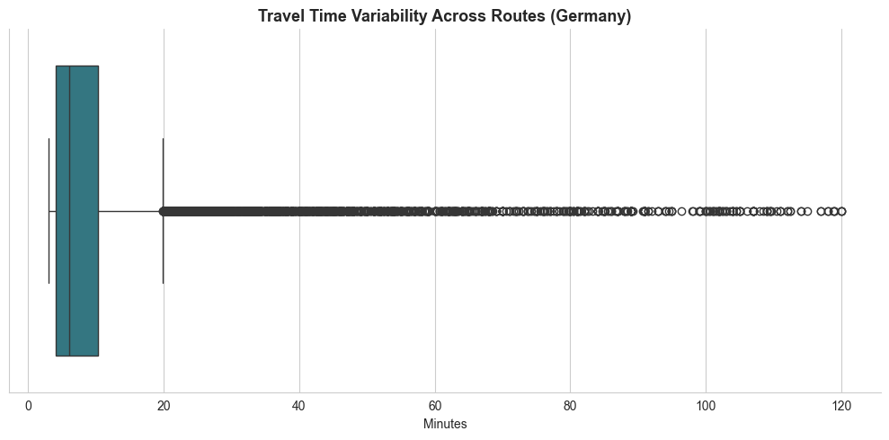
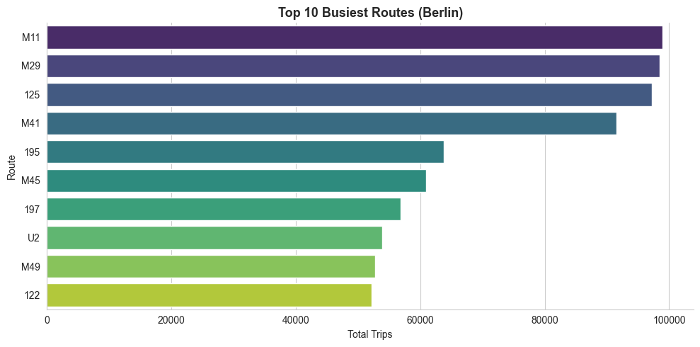
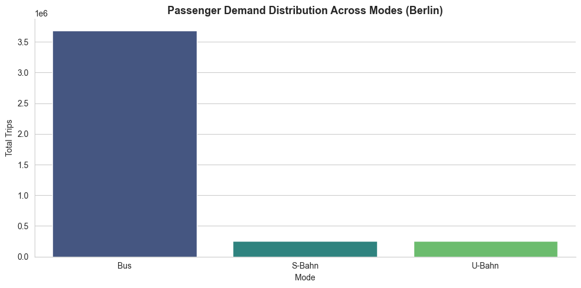
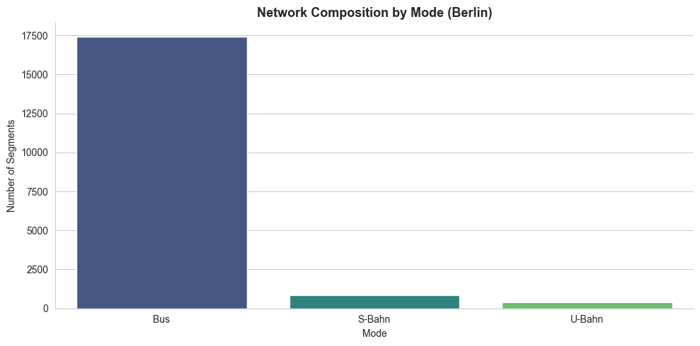
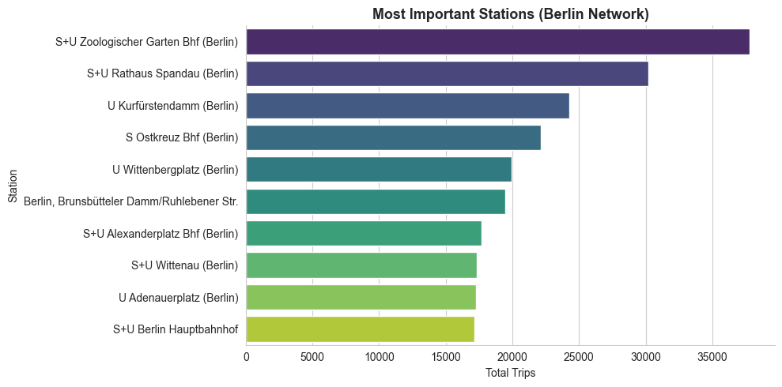
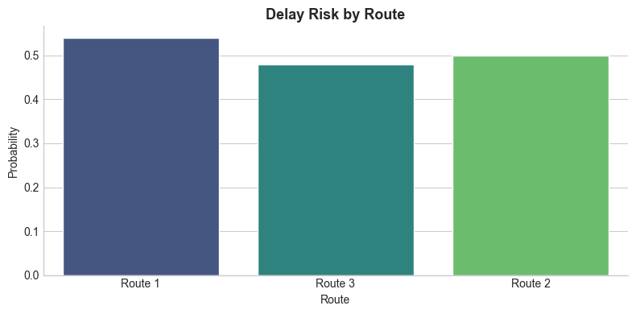

# 🚆 Transport Network Analysis & Optimization System

End-to-end analysis and simulation of public transport networks using GTFS data, graph modeling, and interactive BI dashboards.


## Overview

This project analyzes public transport systems at both macro (Germany) and micro (Berlin) levels, combining data analytics, network modeling, and visualization to uncover operational patterns and inefficiencies.

Berlin is used as a detailed case study within a broader transport network analysis framework.

## Motivation

Urban transport networks operate as complex, interconnected systems where delays and inefficiencies can propagate across the entire network.

This project aims to explore how data analytics, graph modeling, and simulation can be used to better understand these systems and identify opportunities for optimization.

The long-term objective is to bridge the gap between data analysis and real-world transport decision-making through scalable and interpretable models.

## Dashboard

Interactive Tableau dashboard:  
https://public.tableau.com/views/BerlinPublicTransportNetworkAnalysis/Dashboard



--- 

### Key Insights

- Travel times are heavily skewed toward shorter trips, with a long tail of slower connections  
- High-demand routes tend to exhibit longer travel times, indicating congestion hotspots  
- S-Bahn routes show higher average travel times compared to U-Bahn and Bus  
- A small number of routes account for a large share of trips, highlighting critical corridors  

## How to Read the Dashboard

- **Travel Time Distribution** → Overall network efficiency  
- **Travel Time vs Demand** → Congestion patterns  
- **Top Routes** → High-impact corridors  
- **Mode Performance** → System-level differences  


## Visual Analysis (Python)

### Travel Time Analysis



Travel times are highly skewed toward shorter durations, with a small proportion of slower connections.



Certain routes show high variability, indicating inconsistent service reliability.

---

### Demand & Route Analysis



A small number of routes carry a disproportionately high number of trips.



Demand varies across transport modes, reflecting their different roles in the network.

---

### Network Structure



The network is multi-modal, with varying contributions from each transport system.



Key stations act as central hubs within the network.

---

### Delay & Reliability



Certain routes consistently show higher delay risk, indicating bottlenecks.

---

## Cross-Analysis: Python vs Tableau

The analysis was conducted using Python for data processing and modeling, and Tableau for interactive visualization.

- Travel time distributions observed in Python align with dashboard insights  
- High-demand routes identified in Python match those highlighted in Tableau  
- Mode-wise performance trends are consistent across both tools  
- Tableau enhances interpretability through interactive exploration  

## Simulation Engine

A graph-based simulation system evaluates journeys across the transport network.

Key components:
- Graph construction using NetworkX  
- Shortest path routing (Dijkstra)  
- Delay modeling and propagation  
- Multi-route evaluation  

Evaluation metrics:
- Total travel time  
- Number of transfers  
- Delay impact  
- Route efficiency  

## Tech Stack

- Python (Pandas, NumPy)  
- NetworkX (graph modeling)  
- SQL  
- Tableau (visualization)  
- GTFS data  

## Project Structure

```
data/
├── raw/
├── processed/
│ ├── germany/
│ └── berlin/
├── bi/

notebooks/
├── germany/
├── berlin/
├── simulation/

src/
├── simulation/
├── data/
├── features/

dashboard/
└── berlin_transport_dashboard.twbx

outputs/
  ├── images/
  └── tables/
```
---

## Key Takeaways

- Transport networks exhibit highly skewed travel time distributions  
- Demand is concentrated in a small number of key routes  
- Multi-modal systems show distinct performance characteristics  
- Certain nodes act as critical connectivity hubs  

## Author

Nitin Singh  
MSc Data Analytics